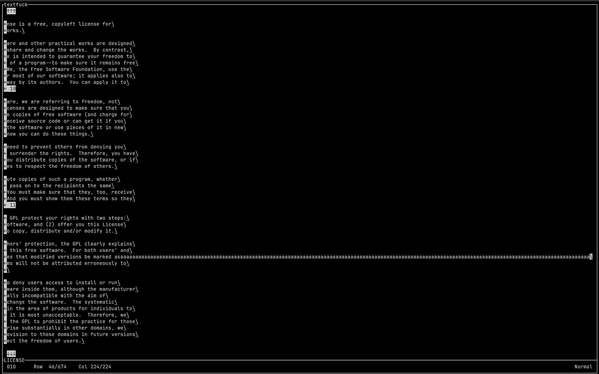

# textfuck
An ncurses-based text editor inspired by Brainfuck written in C++

> "this is horrid" — some guy on discord

</img>

## Usage
`textfuck <file>`

### Features
- [x] Text editing
- [x] Writing to disk
- [x] Innovative control scheme

### Syntax
The syntax is heavily inspired by Brainfuck, with the addition of `q` to exit.

| Command | Meaning |
| ---: | :--- |
| `>` | Move cursor right one   Append character if at end of line |
| `<` | Move cursor left one   Prepend character if at start of line |
| `+` | Increment character by one   Remove character if it overflows |
| `-` | Decrement character by one   Remove character if it overflows |
| `.` | Write file to disk |
| `,` | Set one character from the keyboard |
| `[` | Move to the next line   Append line if at end of file |
| `]` | Move to the previous line   Prepend line if at start of file |
| `q` | Quit |

> [!CAUTION]
> There is no undo. Be careful writing to disk, as the changes will be irreversible.

### Configuration
This is a WYSIWYG editor. What you see when you launch is the editor you get.

## Building
- `make all`
  - This is the default option. It will compile with optimisation level 3
- `make all_debug`
  - This is for debugging. It will compile with the address sanatizer and `-Og`

### Dependencies
- C++20
- ncurses
> [!WARNING]
> This program has only been tested with `ncurses` 6.4 and `g++` with C++20
